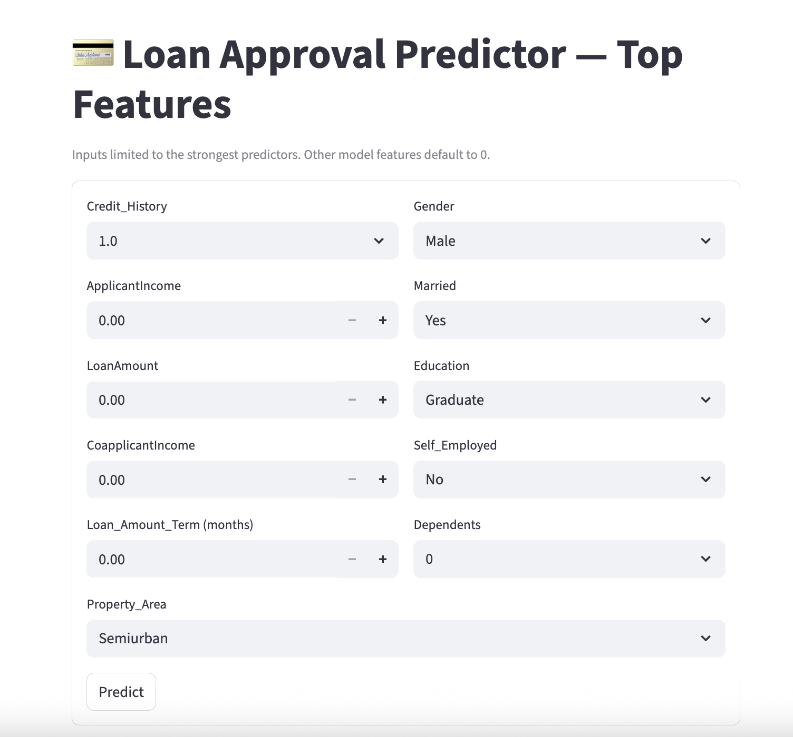

# Loan Approval Prediction — Machine Learning in Action

## Overview
This project predicts whether a loan application will be approved or rejected using Machine Learning models — **Logistic Regression** and **Random Forest Classifier** — and an interactive **Streamlit app** deployed via **ngrok**.

The project is part of my **Machine Learning module** in the **Data Science & AI course**, designed to connect theory with practical implementation.

---

## Project Steps

### 1️⃣ Data Preparation
- Converted the target variable (`Loan_Status`) from “Y/N” to binary (1 = approved, 0 = rejected)
- Filled missing values using **median imputation**
- Encoded categorical variables using **One-Hot Encoding**
- Removed identifiers such as `Loan_ID`

### 2️⃣ Model Training
- Split dataset into **80% training / 20% testing**
- Trained two models:
  - **Logistic Regression** — baseline model
  - **Random Forest Classifier** — for complex patterns & feature interactions

### 3️⃣ Evaluation
- Metrics: Accuracy, ROC AUC, Precision, Recall, and F1-score
- Compared both models for stability and fairness

---

## Results

| Model | Accuracy | ROC AUC | Key Insight |
|--------|-----------|----------|-------------|
| Logistic Regression | 85.37% | 0.8477 | Excellent sensitivity (recall = 98.8%) but slightly lenient rejections |
| Random Forest | 86.18% | 0.8592 | Stronger balance with fewer false approvals |

**Top 5 Features by Importance**
1. Credit History  
2. Applicant Income  
3. Loan Amount  
4. Coapplicant Income  
5. Property Area  

---

## Deployment
A live **Streamlit** interface allows users to input applicant details and predict loan approval in real-time.  
Deployed securely using **ngrok** for external access.

**Run locally:**
```bash
streamlit run app.py

ngrok http 8501
pip install -r requirements.txt

🔗 [View Full Google Colab Notebook](https://colab.research.google.com/drive/1oQZLNxddXA1jnpIAx9MgJG4QEnrG77n1?usp=sharing)


